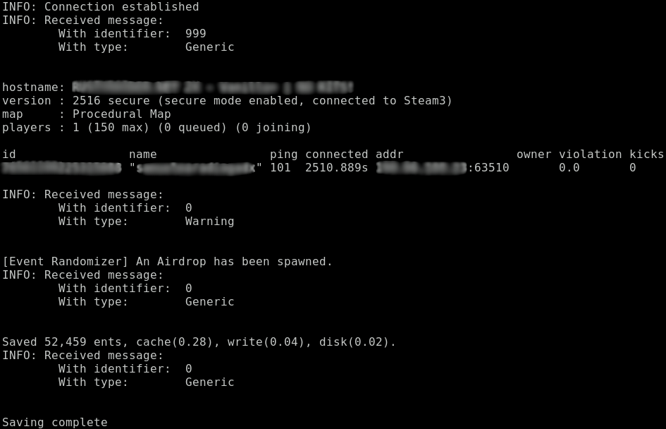

# rrccon - Rust Rcon Message Aggregator



## Before you start

Edit the `config.h` file to set the server address, port, and password.

```c
#define ADDRESS     "<ip address>"
#define PORT        <port>
#define PASSWORD    "<password>"
```


## Install

#### Dependencies

`sudo apt install libwebsockets-dev libjansson-dev libsqlite3-dev`

#### Install

`sudo make install`

## Usage

`rrccon`

All messages are logged in `/var/lib/rrccon/rrccon.db`

### License:

```
This program is free software.
It is licensed under the GNU GPL version 3 or later.
That means you are free to use this program for any purpose;
free to study and modify this program to suit your needs;
and free to share this program or your modifications with anyone.
If you share this program or your modifications
you must grant the recipients the same freedoms.
To be more specific: you must share the source code under the same license.
For details see https://www.gnu.org/licenses/gpl-3.0.html
```
